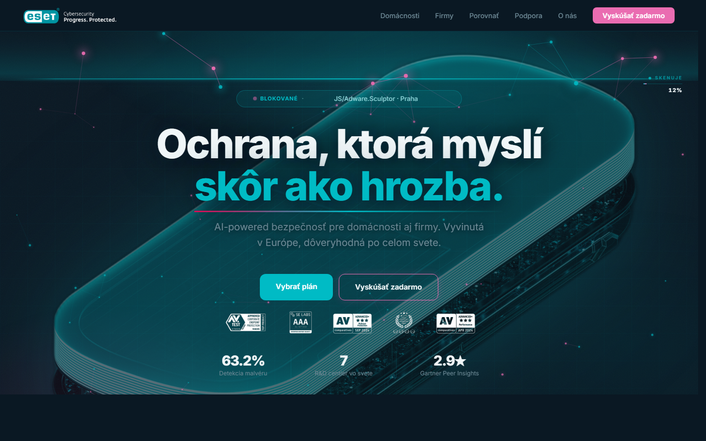
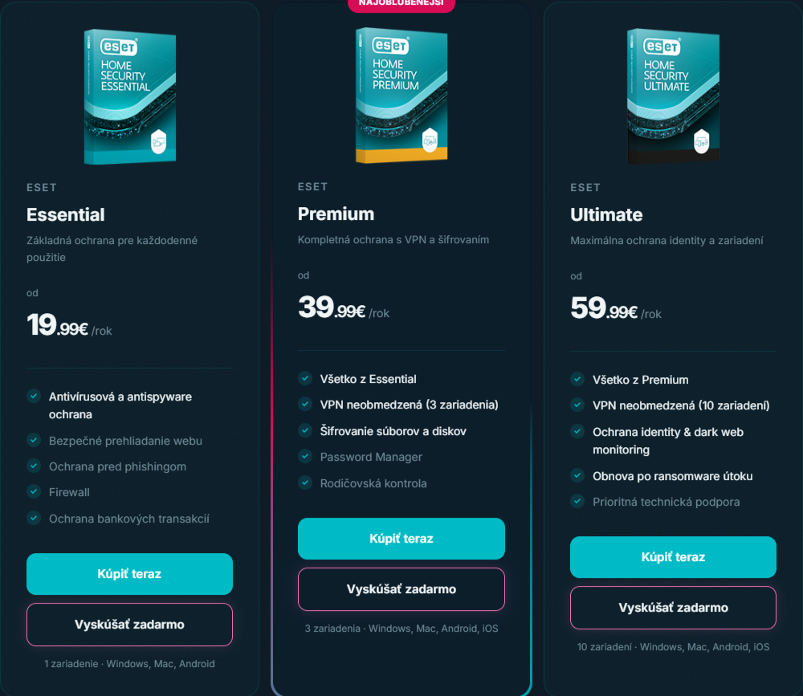
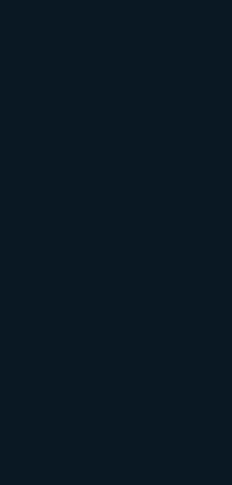
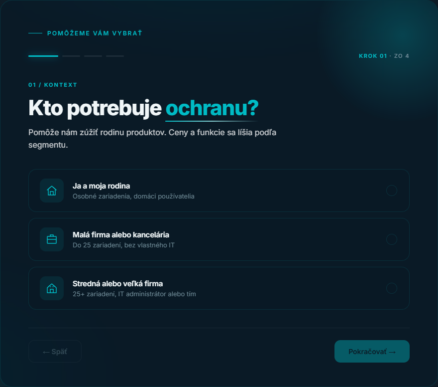
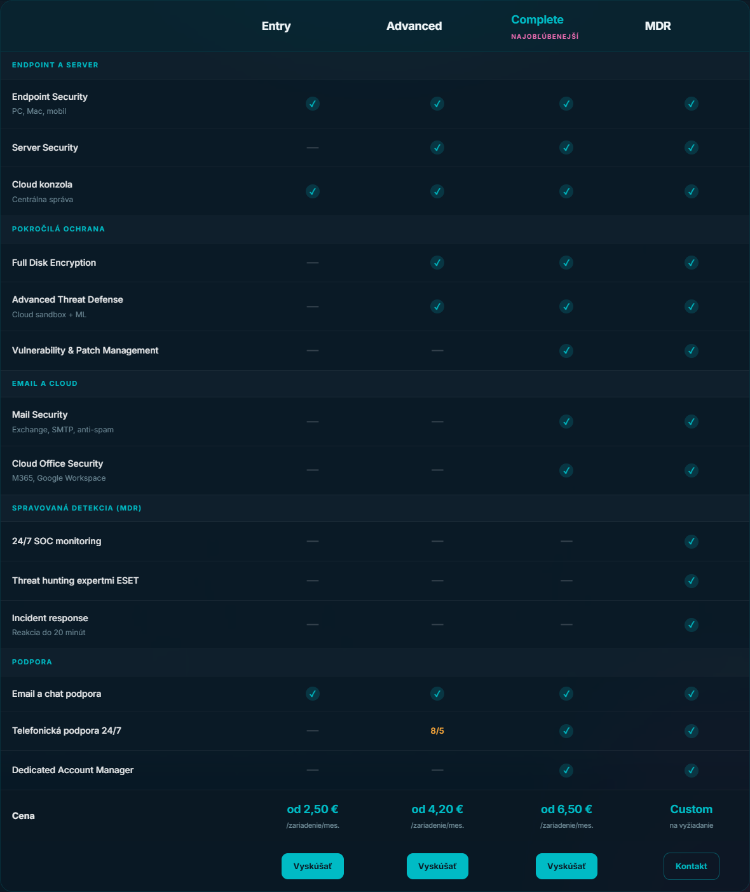
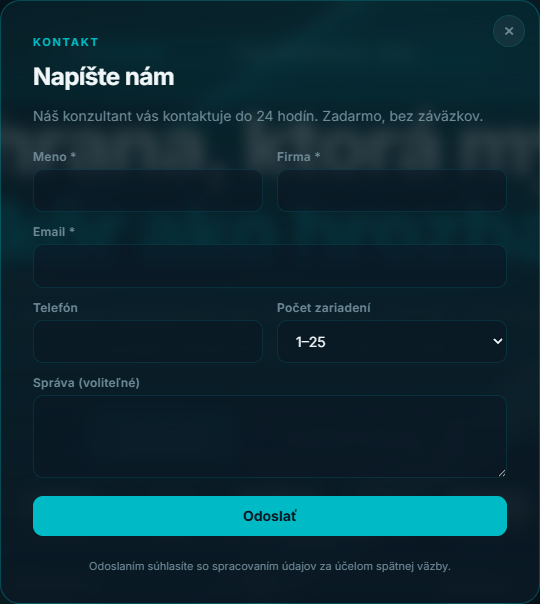
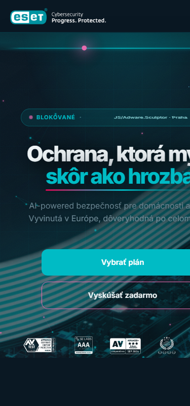

# ESET.com/sk — Redesign Case Study

> High-fidelity interaktívny prototyp redesignu ESET homepage + key flows.
> Vanilla HTML / CSS / JS. Bez frameworku. Bez závislostí (okrem Google Fonts).

**Live:** https://leumasdam.github.io/eset-segmentation/
**Repo:** https://github.com/leumasdam/eset-segmentation



---

## 1. Project at a glance

| | |
|---|---|
| **Brief** | Redesign ESET.com/sk — slovenský brand v kybernetickej bezpečnosti — s cieľom zlepšiť konverziu B2C aj B2B segmentu, modernizovať vizuál bez straty brand identity. |
| **Role** | Solo designer + developer |
| **Stack** | HTML + CSS (Custom Properties, Houdini `@property`, glassmorphism) + Vanilla JS (Canvas API, IntersectionObserver, no build step) |
| **Status** | Working prototype — 7 stránok, 3 interaktívne flows, deployed na GitHub Pages |
| **Time** | ~40 hodín naprieč 14 dňami |

---

## 2. Problem framing

Pôvodný ESET web má tri opakujúce sa problémy:

1. **Segment split nejasný** — homepage mieša B2C a B2B obsah bez jasného rozdelenia. User nevie, či je pre rodinu alebo firmu, kým neprejde 2-3 sekciami.
2. **B2B konverzná friction** — pre firemného kupujúceho sú dve možnosti: "Vyskúšať zadarmo" (vyžaduje registráciu + závisí od konfigurácie) alebo "Kontakt konzultanta" (telefón / email / čakanie). Chýba "ukáž mi vhodný balík **teraz**".
3. **Vizuálne staré** — heavy gradients, generic stock photos, žiadny coherent design system. Vyzerá ako 2018.

### Návrhové hypotézy

- **H1**: Pill switcher (Home / Business) hneď v hero zníži time-to-relevance pre obe publika
- **H2**: Interaktívny **business selector** (3 otázky → odporúčaný balík) odstráni B2B konverznú friction medzi "wizard" a "konzultant"
- **H3**: Particle network + scan animation + glassmorphism vytvoria modern *security feel* bez straty čitateľnosti

---

## 3. Design system

### Farby (ESET brand 2023 + accent extensions)

```
Tyrkysová škála:
  #004B55  teal-heavy
  #00717F  teal-dark
  #0095A1  teal-mid
  #00BBC5  teal-bright   ← primary, CTA "Kúpiť teraz"
  #87CFD3  teal-light

Akcentové:
  #D80B55  crimson         ← badge, výrazné akcie
  #EA6CB1  crimson-light   ← sekundárne CTA, ružová
  #FEAA3A  orange          ← hviezdy, recenzie
  #00C0F2  blue            ← zriedkavé akcenty

Neutrálne (tmavé pozadie):
  #0A1823  dark
  #0d1e2b  dark-2
  #122432  dark-3
  #F0F6F8  text (90% biela)
```

### Typografia

**Inter** (Google Fonts) — 300/400/500/600/700/800. `font-display: swap`. Preconnect na `fonts.googleapis.com` + `fonts.gstatic.com` pre rýchly first paint.

### Z-index architektúra

```
0   #ambient orbs (fixed)
0   hero-render image
1   hero decorations (shield, progress shapes)
2   noise texture (body::before) + hero content
3   všetky sekcie (how, switcher, products, trust, trial, footer)
101 navbar
1000 modal backdrop
```

---

## 4. Key flows & features

### 4.1 Hero — particle network + scan animation

68 particles na desktope (36 na mobile pre batériu), náhodne pohyblivé, prepojené líniami (LINK_DIST = 128px). Každých 6.5s **scan beam** prejde zhora nadol; particles ktoré preuká pulzujú. HUD ukazuje stav: `INICIALIZÁCIA → SKENUJE 73% → BEZPEČNÉ / 0 HROZIEB`.

**Performance optimizations:**
- `prefers-reduced-motion: reduce` → canvas vypnutý, single static frame
- IntersectionObserver pauznutie keď hero scrollne mimo viewport
- `visibilitychange` pauza pri tab v pozadí
- Pointer-events: throttled cez `requestAnimationFrame`, cached `getBoundingClientRect`

```js
const COUNT = reducedMotion ? 0 : (isMobile ? 36 : 68);
const LINK_DIST = isMobile ? 110 : 128;
```

### 4.2 Pill switcher — Home / Business

Glassmorphism pilulka pinned v scroll-into-view bode. Jeden klik prepne celý `.tab-content` (pricing cards pre domácnosti ↔ business guide pre firmy). Bez page reload, bez frameworku — len `display: none/block` + `classList`.

### 4.3 Pricing cards (Home)



Tri karty: **Essential / Premium / Ultimate**. Stredná (Premium) má **animovaný conic-gradient border** cez CSS Houdini `@property`:

```css
@property --angle {
  syntax: "<angle>";
  initial-value: 0deg;
  inherits: false;
}
.card.featured::before {
  background: conic-gradient(from var(--angle),
    transparent, #00BBC5, #D80B55, transparent);
  animation: spin-border 4s linear infinite;
}
@keyframes spin-border { to { --angle: 360deg; } }
```

Pri vstupe sa karta 3D-tiltne podľa pozície kurzora (vanilla JS, throttled `pointermove`).

### 4.4 Business selector — 3-step interactive wizard ⭐



Hlavná konverzná inovácia. Nahrádza 4-krokový statický "guide" interaktívnym selectorom:

| Krok | Otázka | Typ |
|---|---|---|
| 1 | Aká veľká je vaša firma? | Single-select: 1–25 / 26–250 / 250+ |
| 2 | Čo chcete chrániť? | Multi-select chips: Endpointy (locked) / Servery / Email / Cloud |
| 3 | Ako riadite IT? | Single-select: Vlastný / Občasná pomoc / Spravujte za nás |
| → | Výsledok | Odporúčaný **ESET PROTECT** balík + 2 alternatívy + Compare link |

**Decision tree** (zjednodušená):

```js
function recommend() {
  if (state.it === 'mdr')                              return 'mdr';
  let tier = 'entry';
  if (size === 'mid' || size === 'enterprise')         tier = 'advanced';
  if (scope.includes('server'))                        tier = 'advanced';
  if (scope.includes('email') || scope.includes('cloud')) tier = 'complete';
  if (size === 'enterprise' && scope.length >= 3)      tier = 'complete';
  return tier;
}
```

Auto-advance po single-select (220ms delay aby user videl ✓ tick). Klikateľné progress dots umožňujú návrat. State je čisto klientsky — žiadny formulár, žiadna registrácia.

### 4.5 Trial wizard (`vybrat-plan.html`)



Samostatná stránka, 4 otázky:
1. Kto potrebuje ochranu? (rodina / malá firma / business)
2. Koľko zariadení? (range slider 1–25+)
3. Aké systémy? (multi-select: Windows / macOS / Android / Linux)
4. Čo je najdôležitejšie? (multi-select: antivírus / VPN / identity / kids / encryption)

Výsledok: konkrétny ESET produkt s features + dynamicky kalkulovaná cena podľa zariadení.

### 4.6 Compare page (`porovnat-baliky.html`)



Side-by-side feature matrix s tab switcherom Home / Business. Pre domácnosti porovnáva Essential/Premium/Ultimate, pre firmy Entry/Advanced/Complete/MDR. Sticky header, glassmorphism. Hashlink `#firmy` deep-link na business tab (linkuje z biz-selector "Porovnať všetky balíky →").

### 4.7 Contact modal



Klientsky form (meno / firma / email / tel / počet zariadení / správa) — validácia HTML5, ESC + backdrop close, focus trap (vráti focus na trigger po close). Otvára sa cez ľubovoľný `[data-open-contact]` element. Success state s ✓ ikonou.

---

## 5. Technical decisions

### Prečo vanilla, nie framework?

**Kontext**: portfolio prototyp. Cieľ — ukázať schopnosť stavať od základov bez závislostí. Bonus: zero build step, deploy = `git push`, JS bundle 0 kB (len inline scripts), prvý paint nemá blokujúce dependencies.

**Trade-off**: pri väčšom projekte by sa interactive state management (wizard, modal, tabs) lepšie spravovala vo frameworku. Pri tejto veľkosti je vanilla pohodlnejšie.

### Glassmorphism, ktorá naozaj funguje

`backdrop-filter: blur(20px) saturate(160%)` potrebuje **ambient vrstvu** pod sebou aby bolo čo "rozmazávať". Bez nej je glass neviditeľný. Riešenie: `#ambient` div s 3 radiálnymi gradient orbs (fixed position, full viewport, z-index: 0). Všetky glass karty `backdrop-filter` cez túto vrstvu a vyzerajú ako z mliečneho skla.

### Animovaný border bez SVG

Klasický trick: pseudo-element `::before` o 1.5px väčší (`inset: -1.5px`) s `conic-gradient` a animovaným `--angle` cez Houdini. Žiadne SVG, žiadny canvas. CSS-only.

### Performance audit

- `width`/`height` attributes na hero-render + badges (žiadny CLS)
- `fetchpriority="high"` + `decoding="async"` na hero-render (LCP candidate)
- `loading="lazy"` na product box images (below the fold)
- Mobile: 68 particles → 36 (-47%), tilt 3D effects skipped
- Drop-shadow filtre len kde treba (odstránené z hot paths)

### A11y

- Skip-link na všetkých 7 stránkach
- `:focus-visible` ring (tyrkys 2px) globálne, neaktívny pri myši
- ARIA: dialog modal, button labels, aria-pressed na chips, role tablist na pill switcher
- Keyboard navigation funguje v biz selector cez Tab + dots, v compare page cez tabs
- `prefers-reduced-motion` rešpektovaný (canvas off, animations off)
- Color contrast: text na dark = #F0F6F8 (≥7:1 AAA), muted = rgba(255,255,255,0.6) (≥4.5:1 AA)

### SEO

- Open Graph + Twitter cards na všetkých stránkach
- Canonical URLs
- Structured data (JSON-LD): Organization, WebSite, Product × 2 (HOME aggregate offer, PROTECT aggregate offer)
- `theme-color: #0A1823` (PWA-ready)

### Analytics scaffolding

Klientsky `window.track(name, props)` helper:

```js
window.track = function (name, props) {
  if (window.dataLayer) window.dataLayer.push({ event: name, ...props });
  if (window.plausible) window.plausible(name, { props });
  if (location.hostname === 'localhost') console.log('[track]', name, props);
};
document.addEventListener('click', (e) => {
  const el = e.target.closest('[data-track]');
  if (el) window.track(el.dataset.track, { ... });
});
```

Pripravené pre GA4, Plausible, Segment — bez ďalších zmien v markup. Wired na: nav, hero CTAs, pricing × 3 tiers × {buy, trial}, biz-selector step + result, wizard step + result, trial banner, footer.

---

### 4.8 Mobile



Plný responzív od 320px hore. Mobile-specific tweaks:
- Pricing cards stack na 1 stĺpec
- Review cards horizontálny carousel s peek (vidno okraj nasledujúcej karty)
- Trust stats grid stack
- Particle network: 36 namiesto 68 particles
- Hero render: mobile-specific image variant (`hero-render-mobile.png` cez `<picture>` source)

---

## 6. Stránky

| Stránka | Účel | Highlights |
|---|---|---|
| `index.html` | Homepage | Hero canvas + pill switcher + pricing/biz wizard + trust + trial banner |
| `domacnosti.html` | B2C hub | 3 HOME plan cards + trial banner |
| `firmy.html` | B2B hub | Hero + 3 PROTECT cards + 4-step guide |
| `podpora.html` | Centrum podpory | 4 support categories + downloads + FAQ accordion |
| `o-nas.html` | About | Hero + 4-stat counter + 3 mission cards + history timeline |
| `vybrat-plan.html` | Trial wizard | 4-step recommendation flow |
| `porovnat-baliky.html` | Compare matrix | Tab switcher + side-by-side feature tables |

---

## 7. Čo by som spravil ďalej

- **Contact modal na všetky subpages** — momentálne len index + compare, subpages odkazujú na podpora#contact ako fallback
- **Image optimization** — `eset-badges.png` → WebP/AVIF, hero-render → multiple sizes via `srcset`
- **Real backend** — formuláre na Formspree / Netlify Forms / vlastný endpoint
- **Light theme variant** — všetko cez CSS custom properties, prepnúť cez `[data-theme="light"]`
- **i18n** — momentálne SK-only; pridať EN toggle (recruiteri zo zahraničia)
- **Lighthouse 100/100/100/100** — current je dobrý, ale neauditovaný; finálny audit + fixy

---

## 8. Lessons learned

**1. Canvas animations sú levné len pri správnom rozpočte.**
68 particles s O(n²) link computation = 2278 distance checks per frame. Bez `IntersectionObserver` pauznutia a mobile downgrade (na 36) by to zabíjalo batériu. Performance audit musí byť integrálna časť, nie afterthought.

**2. Glassmorphism = ambient layer.**
Bez `#ambient` vrstvy pod glass elementmi je `backdrop-filter` neviditeľný. Architektúra musí byť navrhnutá od začiatku — nedá sa "pridať glass" k existujúcemu dizajnu.

**3. Interaktívny selector beats static guide.**
4-krokový statický "guide" v B2B sekcii bol mŕtvy obsah. Replacement: 3-step interaktívny wizard ktorý končí konkrétnym produktom + CTA. Konverzná friction klesá z (registrácia | telefón) → (3 kliky | konzultant).

**4. `clip-path` negatívne hodnoty nie sú reliabilné.**
Po multiple iteráciách: `clip-path: inset(0 0 -110vh 0)` sa v niektorých browseroch clampne na 0. Spec hovorí "negative not allowed". Spoliehať sa na ne je krehké. Alternatíva: `position: fixed` alebo `overflow: visible` + element height.

**5. Vždy testovať na cieľovom viewport, nie v DevTools.**
Veľa iterácií nad hero render bleed (≥1800px viewport) sa nedalo overiť bez live ultra-wide monitora. DevTools responsive mode klame na niektorých CSS features.

---

**Built with [Claude Code](https://claude.com/claude-code)** — design discussions, iteration, problem-solving v páre s AI.

